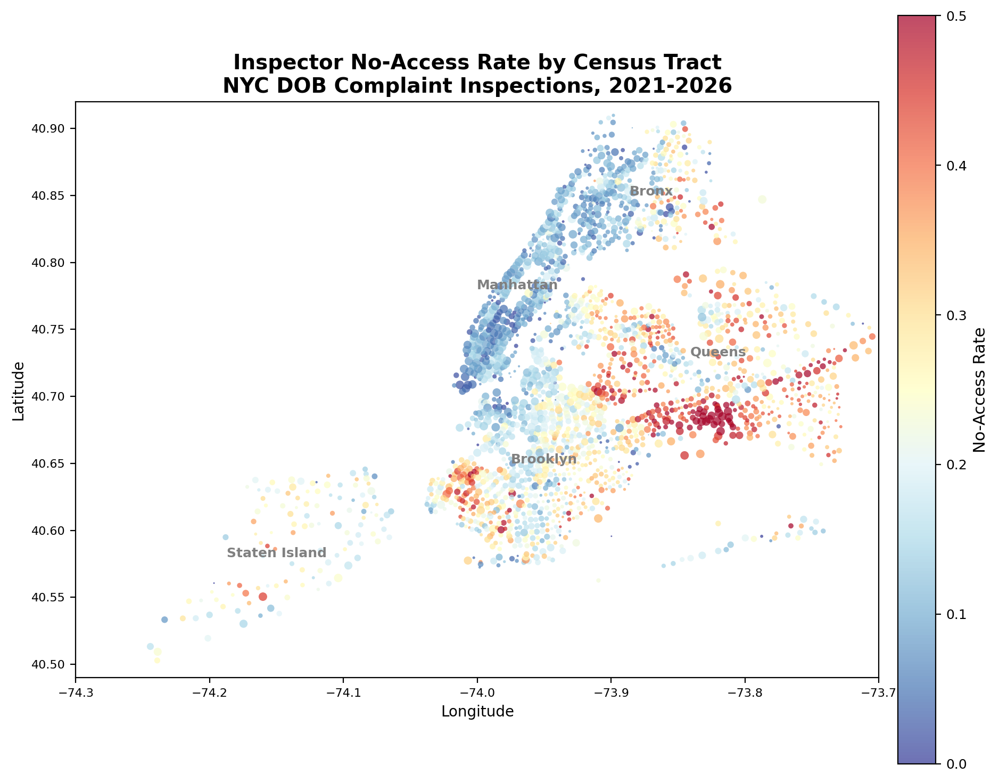

# Determinants of Inspector No-Access in NYC Building Complaint Inspections

## 1. Overview

When DOB inspectors respond to building complaints, they frequently cannot complete the inspection because they are unable to gain access to the property. Across 574,049 complaint inspections (2021--2026) with substantive outcomes, the overall no-access rate is **20.2%** --- one in five inspections fails at the front door.

This analysis examines the building-level and neighborhood-level determinants of no-access outcomes, with particular attention to owner-occupancy, housing stock composition, immigration, and race.

---

## 2. Building-Level Determinants

### 2.1 Owner-Occupancy

We measure owner-occupancy using NYC's School Tax Relief (STAR) homestead exemption, which property owners must actively claim on their primary residence. This is a direct administrative signal of owner-occupancy, covering 278,054 unique tax lots in our data.

Properties with a STAR exemption have a **28.2% no-access rate**, compared to **21.3%** for non-STAR properties --- a 6.9 percentage point gap ($N = 514{,}029$).

This effect survives controls for complaint type and neighborhood. In an OLS regression within complaint category $\times$ NTA cells (comparing buildings of the same complaint type in the same neighborhood), the STAR owner-occupancy coefficient is **+3.5 percentage points** ($t = 25.2$).

However, as we show in the fully nested model (Section 5.2), much of this effect reflects the *types of buildings* that owner-occupants live in --- predominantly small 1--2 family homes where any occupant (owner or tenant) can block access. When building-type controls are added alongside STAR, the STAR coefficient shrinks to +0.6pp, while the building-type effect is +5.2pp. The raw owner-occupancy gap is real, but it is primarily architectural: owner-occupants live in buildings that are structurally harder to access, rather than being substantially more likely to refuse entry than tenants in the same building type.

### 2.2 Building Size and Type

No-access rates decline monotonically with building size:

| Residential Units | No-Access Rate | N |
|---|---|---|
| 1 unit | 31.1% | 82,596 |
| 2 units | 35.6% | 110,238 |
| 3--4 units | 31.5% | 52,778 |
| 5--10 units | 19.8% | 50,157 |
| 11--20 units | 16.2% | 29,512 |
| 21--50 units | 12.4% | 53,627 |
| 51+ units | 7.1% | 99,885 |

Two-unit buildings have the *highest* no-access rate (35.6%) --- higher than single-family homes. This partly reflects that 2-family homes receive a higher share of illegal conversion complaints (24.1% vs 20.1% for 1-family), which have very high no-access rates. But the 2-family $>$ 1-family gap persists even excluding illegal conversion complaints (27.6% vs 24.4%), suggesting that 2-family buildings are inherently harder to access --- perhaps because the second unit's occupant (whether tenant or owner) can independently refuse entry.

By building class, **B (2-family): 37.4%** is the highest, followed by A (1-family): 31.9%, C (walk-up): 24.6%, S (mixed residential/commercial): 23.2%, and D (elevator apartment): 7.1%.

Each additional floor reduces no-access probability by 0.28 percentage points within category $\times$ NTA, reflecting that taller buildings are more likely to have professional management.

### 2.3 Complaint Category

The complaint type is the strongest overall predictor of no-access (R$^2$ = 31.5% from category fixed effects alone). Illegal conversion complaints have a **74.9%** no-access rate --- three quarters of these inspections fail. Boiler complaints at owner-occupied buildings reach **53.9%**, compared to 13.3% at non-owner-occupied buildings (a 40.6pp gap, the largest category-specific owner-occupancy differential).

By contrast, elevator complaints have near-zero no-access rates (0.5--0.8%), as do construction safety compliance inspections (0.0%). These involve exterior or common-area inspections that do not require individual occupant cooperation.

### 2.4 Property Owner Race

We predict owner race using Bayesian Improved Surname Geocoding (BISG; Imai \& Khanna, 2016), implemented via the \texttt{surgeo} Python package. BISG combines Census surname frequency tables with geographic race distributions to produce posterior probabilities of race for each individual name. We restrict to properties with individual (non-entity) owners with parseable surnames ($N = 150{,}203$ inspections).

\textbf{Improved prior.} Standard BISG uses overall population racial composition as the geographic prior. Because homeownership rates differ by race --- whites are 31\% of NYC's population but 43\% of property owners, while Hispanics are 27\% of population but only 18\% of owners --- the population prior systematically misclassifies owner race. We construct an improved prior using ACS Table B25003 (tenure by race of householder), which gives the racial composition of owner-occupants at the tract level. We report results using both priors.

\begin{table}[h]
\centering
\small
\caption{No-Access Rates by Predicted Owner Race (BISG)}
\begin{tabular}{lccc}
\hline
Predicted Race & N & No-Access Rate & Violation Rate \\
\hline
White & 61,670 & 25.9\% & 22.6\% \\
Black & 22,393 & 33.3\% & 24.1\% \\
Hispanic & 15,420 & 35.4\% & 22.1\% \\
Asian & 50,720 & 41.8\% & 16.3\% \\
\hline
\multicolumn{4}{l}{\small Owner-race prior. $N = 150{,}203$ inspections with individual owners.}
\end{tabular}
\end{table}

Raw no-access rates vary substantially: Asian-owned properties have the highest rate (41.8\%), followed by Hispanic (35.4\%), Black (33.3\%), and White (25.9\%). However, these raw differences reflect building type and neighborhood composition, not owner race per se.

In regressions with complaint category $\times$ census tract fixed effects and building controls (Table 6), the P(Black) coefficient is \textbf{insignificant} across all BISG specifications, while the P(Asian) coefficient is large and positive (+6.0pp, $t = 12.9$ with the owner-race prior). The results are robust to the choice of BISG prior:

\begin{table}[h]
\centering
\small
\caption{No-Access $\sim$ Owner Race: Sensitivity to BISG Prior}
\begin{tabular}{lccc}
\hline
BISG Method & P(Black) & P(Hispanic) & P(Asian) \\
\hline
Surgeo (standard) & $-$0.017* & $-$0.020** & +0.049*** \\
Population prior & $-$0.013 & $-$0.014* & +0.059*** \\
Owner-race prior & $-$0.009 & $-$0.014* & +0.060*** \\
\hline
\multicolumn{4}{l}{\small Cat $\times$ Tract FEs + building controls. White is the omitted category.}
\end{tabular}
\end{table}

Asian-owned properties are 5--6 percentage points more likely to result in no-access within the same census tract and complaint type, even controlling for building characteristics. This parallels the finding (Section 3) that Asian-concentrated neighborhoods have high no-access rates, and suggests the mechanism operates at the property level, not just the neighborhood level. Possible explanations include language barriers, cultural norms regarding government inspectors, or property management practices.

Black-owned properties show no significant excess no-access once within-tract comparisons are made, and the point estimate is actually negative. The raw Black--white gap (8.4pp) is entirely attributable to the neighborhoods and building types where Black owners' properties are located.

---

## 3. Census Tract Demographic Correlates

We merge inspection-level no-access outcomes to ACS 2022 5-year estimates at the census tract level (2,220 tracts with 10+ inspections), and examine which neighborhood demographics predict higher no-access rates.

### 3.1 Bivariate Correlations

| Variable | Weighted $r$ | $p$-value |
|---|---|---|
| % Owner-occupied (Census) | **+0.450** | $<0.001$ |
| % Foreign-born | **+0.425** | $<0.001$ |
| % Asian | **+0.314** | $<0.001$ |
| % White (non-Hispanic) | **$-$0.257** | $<0.001$ |
| Poverty rate | $-$0.182 | $<0.001$ |
| % Non-English at home | +0.075 | 0.005 |
| Median household income | +0.031 | $<0.001$ |
| % Black (non-Hispanic) | +0.005 | 0.364 |
| % Hispanic/Latino | $-$0.027 | 0.091 |

The two strongest correlates are **owner-occupancy** ($r = +0.45$) and **foreign-born share** ($r = +0.43$). Tracts with more homeowners and more immigrants have substantially higher no-access rates. The Asian share correlation ($r = +0.31$) is driven by neighborhoods with large immigrant homeowner populations (Flushing, Sunset Park, Bensonhurst).

The near-zero correlation with percent Black ($r = +0.005$) is notable: Black neighborhoods do not have elevated no-access rates. Whiter tracts actually have *lower* no-access rates ($r = -0.26$), likely because white-majority tracts in NYC tend to be renter-heavy (Manhattan).

### 3.2 Multivariate Regression (WLS)

Weighted least squares regressions at the tract level, with tracts weighted by number of inspections:

| Variable | Spec 1 | Spec 2 | Spec 3 |
|---|---|---|---|
| Median income (std) | +0.002 | +0.005 | +0.004 |
| % Owner-occupied (std) | **+0.065*** | **+0.073*** | **+0.070*** |
| % Black (std) | | **+0.031*** | **+0.016*** |
| % Hispanic (std) | | **+0.040*** | **+0.023**  |
| % Asian (std) | | **+0.048*** | +0.014** |
| % Foreign-born (std) | | | **+0.042*** |
| % Non-English (std) | | | +0.000 |
| R$^2$ | 0.305 | 0.420 | 0.461 |

Key findings:

**Owner-occupancy dominates.** A one-standard-deviation increase in tract owner-occupancy rate raises the no-access rate by 7.0 percentage points in the full model --- by far the largest coefficient. This effect is stable across all three specifications.

**Foreign-born share is the second-strongest predictor** ($\beta = +0.042$, $t = 7.4$), even after controlling for race, income, and owner-occupancy. Immigrant neighborhoods have higher no-access rates independent of homeownership. Possible mechanisms include language barriers (though % non-English drops out once foreign-born is included), distrust of government inspectors, or unfamiliarity with inspection procedures.

**Race effects are present but moderate.** Controlling for owner-occupancy, income, and immigration, tracts with larger Black ($\beta = +0.016$) and Hispanic ($\beta = +0.023$) populations have modestly higher no-access rates. The Asian coefficient ($\beta = +0.014$) shrinks substantially once foreign-born share is included, suggesting the Asian correlation is primarily an immigration effect.

**Income is not a significant predictor** once owner-occupancy is controlled. The quintile analysis confirms a U-shaped pattern: both the poorest (Q1: 16.0%) and richest (Q5: 17.2%) tracts have low no-access rates, while middle-income tracts (Q3--Q4: 27--28%) have the highest. This reflects that low-income tracts are renter-heavy (easy access) and high-income tracts have professional management, while middle-income tracts contain the homeowner-occupied buildings where access is most contested.

### 3.3 Geographic Distribution

The map reveals clear spatial clustering:

- **Southeast Queens, eastern Brooklyn, and central Staten Island** (deep red) have the highest no-access rates, corresponding to neighborhoods with large concentrations of owner-occupied 1--2 family homes and immigrant populations.
- **Manhattan below 96th Street** (blue) has consistently low no-access rates, reflecting its renter-dominated, professionally-managed housing stock.
- **South Bronx and central Brooklyn** show moderate rates.

---

## 4. Implications

The analysis reveals that no-access is fundamentally a **property rights and housing structure problem**, not an inspector effort problem. The dominant determinants are:

1. **Owner-occupancy** --- the occupant controls the door and may have incentives to refuse entry
2. **Immigration** --- language barriers, institutional unfamiliarity, or distrust of government
3. **Building size** --- small buildings lack the professional management that facilitates access in large buildings
4. **Complaint type** --- complaints about illegal interior conditions (conversions, boilers) inherently require cooperation that may not be forthcoming

These findings suggest that policy interventions to reduce no-access rates should focus on the access mechanism (advance notification procedures, multilingual outreach, legal authority for compelled access in specific complaint categories) rather than inspector behavior --- consistent with the finding from the main analysis that inspector strictness and no-access rates are uncorrelated ($r = -0.007$, $p = 0.86$).

---

## 5. Fully Nested Model

We estimate a fully nested OLS model that progressively adds six blocks of covariates, with complaint category fixed effects absorbed via within-transformation throughout. Heteroskedasticity-robust standard errors (HC1) are reported. $N = 536{,}553$.

The blocks are: (A) complaint priority; (B) assigned unit fixed effects (15 DOB operational units --- e.g., Elevator Division, Quality of Life Unit, Construction Safety Enforcement); (C) inspector leave-one-out no-access rate; (D) building characteristics including STAR owner-occupancy, building-type proxy, floors, year built, and building area; (E) borough fixed effects; and (F) census tract demographics from the ACS.

Owner-occupancy is measured two ways: (1) a \textbf{STAR exemption indicator}, based on whether the property has a NYC School Tax Relief homestead exemption on file with the Department of Finance (278,054 unique BBLs), which directly identifies owner-occupied primary residences; and (2) a \textbf{building-type proxy}, based on whether the property is classified as 1--2 family residential with 3 or fewer units. Both are included jointly to separate the effects of verified owner-occupancy from building access structure.

\begin{table}[h]
\centering
\small
\caption{Fully Nested OLS: Determinants of No-Access}
\begin{tabular}{lcccccc}
\hline
Variable & Spec 1 & Spec 2 & Spec 3 & Spec 4 & Spec 5 & Spec 6 \\
\hline
Priority B & +0.192*** & +0.102*** & +0.091*** & +0.082*** & +0.080*** & +0.080*** \\
Priority C & +0.031*** & $-$0.026*** & +0.002 & $-$0.005 & $-$0.005 & $-$0.005 \\
Priority D & +0.125*** & $-$0.002 & +0.020*** & +0.016*** & +0.012** & +0.011** \\
Unit FEs (15) & & Yes & Yes & Yes & Yes & Yes \\
LOO no-access (std) & & & \textbf{+0.072***} & \textbf{+0.067***} & \textbf{+0.065***} & \textbf{+0.065***} \\
STAR owner-occ & & & & +0.003* & +0.004*** & +0.004** \\
Bldg-type proxy & & & & \textbf{+0.051***} & \textbf{+0.046***} & \textbf{+0.050***} \\
Floors (std) & & & & $-$0.014*** & $-$0.012*** & $-$0.011*** \\
Year built (std) & & & & $-$0.003*** & $-$0.003*** & $-$0.003*** \\
Bldg area (std) & & & & $-$0.002** & $-$0.002** & $-$0.002** \\
Brooklyn & & & & & +0.020*** & +0.021*** \\
Queens & & & & & +0.038*** & +0.031*** \\
Bronx & & & & & $-$0.007*** & $-$0.018*** \\
Staten Island & & & & & $-$0.018*** & $-$0.017*** \\
\% Hispanic (std) & & & & & & \textbf{+0.009***} \\
\% Asian (std) & & & & & & \textbf{+0.005***} \\
Log med.\ income (std) & & & & & & +0.002*** \\
\% Foreign-born (std) & & & & & & +0.000 \\
\% Black (std) & & & & & & +0.000 \\
\% Owner-occ tract (std) & & & & & & $-$0.001 \\
\hline
$R^2$ & 0.010 & 0.047 & 0.063 & 0.069 & 0.071 & 0.072 \\
\hline
\end{tabular}
\end{table}

### 5.1 Incremental $R^2$

\begin{table}[h]
\centering
\small
\caption{Incremental $R^2$}
\begin{tabular}{lcc}
\hline
Block added & $R^2$ & $\Delta R^2$ \\
\hline
A: Complaint priority (+ category FE) & 0.010 & +0.010 \\
B: + Assigned unit FEs (15 units) & 0.047 & \textbf{+0.037} \\
C: + Inspector LOO no-access rate & 0.063 & +0.016 \\
D: + Building characteristics & 0.069 & +0.006 \\
E: + Borough FEs & 0.071 & +0.002 \\
F: + Tract demographics & 0.072 & +0.001 \\
\hline
\end{tabular}
\end{table}

Note that these $R^2$ values are *within category* --- the category FEs themselves explain 31.5\% of total variation (Section 2.3), but that variation is absorbed before the regression is run. The assigned unit FEs capture an additional 3.7pp, reflecting that different units handle systematically different complaint types (e.g., the Elevator Division almost never faces no-access at 0.5\%, while the Quality of Life Unit handling illegal conversions faces it routinely).

### 5.2 STAR vs.\ Building-Type Proxy for Owner-Occupancy

A key question is whether the no-access effect of owner-occupancy reflects *who lives there* (verified owner-occupants refusing entry) or *how the building is built* (small residential structures where any occupant can block access). We distinguish these by including both the STAR exemption indicator and the building-type proxy jointly.

\begin{table}[h]
\centering
\small
\caption{STAR vs.\ Building-Type Proxy: Predicting No-Access}
\begin{tabular}{lcc}
\hline
Measure & Alone & Joint \\
\hline
STAR owner-occupied & +0.016*** ($t=12.7$) & +0.006*** ($t=4.8$) \\
Building-type proxy & +0.054*** ($t=40.8$) & +0.052*** ($t=39.3$) \\
\hline
\end{tabular}
\end{table}

When entered alone (with inspector LOO, other building characteristics, and category FEs), the STAR indicator predicts a 1.6pp increase in no-access. But when the building-type proxy is added, STAR shrinks to just 0.6pp while the proxy barely moves (0.054 to 0.052).

This reveals that the no-access problem is primarily about \textbf{building access structure}, not verified owner-occupancy per se. A 2-family home is difficult to access whether or not the specific owner claims a STAR exemption --- the physical reality is that someone inside must open the door, and in a small residential building there is no superintendent, doorman, or management office to provide alternative access. The STAR coefficient captures a small residual effect: conditional on building type, properties where the owner actually lives there are slightly harder to access, perhaps because owner-occupants are more aware of their right to refuse entry or have stronger incentives to conceal violations.

Only 55\% of STAR-exempt properties are captured by the building-type proxy (the proxy misses owner-occupied condos, walk-ups, and other multi-unit building types). But those building types have lower no-access rates to begin with because they typically have common entrances or professional management.

### 5.3 Key Findings from the Nested Model

**Assigned unit is the single largest predictor.** Adding unit FEs increases $R^2$ by 3.7 percentage points --- the largest increment of any block. This reflects that no-access rates vary enormously by operational unit: the Elevator Division (inspecting mechanical rooms with building management cooperation) almost never faces no-access, while the Quality of Life Unit (handling illegal conversion complaints requiring interior residential access) faces it routinely.

**Inspector identity matters beyond unit assignment.** Adding the LOO no-access rate increases $R^2$ by a further 1.6pp \textit{within unit}. A one-standard-deviation increase in an inspector's LOO no-access rate predicts a \textbf{6.5 percentage point} increase in no-access probability ($t = 78$), even controlling for unit, priority, building characteristics, borough, and demographics. Some inspectors are genuinely more persistent at gaining access than others on the same team.

**Building access structure is the dominant building-level predictor.** The building-type proxy coefficient is +0.050 ($t = 34$) in the full model --- far larger than the STAR verified owner-occupancy effect (+0.004, $t = 3.2$). The no-access problem is fundamentally architectural, not tenurial.

**Building height matters.** Each standard deviation increase in floors reduces no-access by 1.1 percentage points ($t = -25$), reflecting that taller buildings have professional management.

**Priority effects change sign with unit controls.** Unconditionally, Priority B and D complaints have higher no-access rates. But conditional on assigned unit, Priority C and D become near-zero or negative --- the unconditional effect was driven by which \textit{units} handle which priorities, not by priority itself.

**Tract demographics add almost nothing once building and borough characteristics are controlled.** The $\Delta R^2$ from adding all seven demographic variables is just 0.001. The tract-level owner-occupancy rate is insignificant once building-level owner-occupancy is included --- confirming that the mechanism operates at the building level, not the neighborhood level. The only significant demographic predictors in the full model are \% Hispanic (+0.009, $t = 12$) and \% Asian (+0.005, $t = 6$), which may capture language barriers or cultural factors beyond what building characteristics capture.

**The full model explains only 5.5\% of within-category variation.** This is low, implying that most of the variation in no-access outcomes is idiosyncratic --- driven by whether the specific occupant happens to be home, willing to answer the door, and cooperative. This is consistent with no-access being fundamentally a property-rights and timing problem rather than a systematically predictable outcome.
